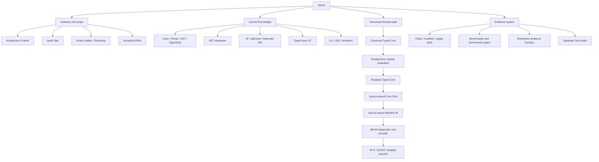

# LangNaux Project Map

Purpose: a compact, durable navigation map for humans and coding agents. Read
this before opening implementation files. Use Serena for symbol-level drill
down instead of loading whole files.

Snapshot: 2026-08-29. The scope and claim status remains governed by
`NAUX_SCOPE_LADDER.md`, `ROADMAP.md`, and accepted ADRs, not by this map.

## Mental model

NAUX is simultaneously:

1. an experimental language that users can run today through a Rust bridge;
2. a proof/evidence-gated compiler research program whose destination is a
   self-owned native toolchain derived from executable typed semantics; and
3. a benchmark and release-evidence system that deliberately separates
   correctness, performance, sovereignty, and usability claims.

Do not collapse the current bridge pipeline into the canonical target
architecture. The distinction is intentional and normative.



## Current user-facing execution path

```mermaid
flowchart LR
    MAIN[src/main.rs] --> RUNCLI[lib::run_cli]
    RUNCLI --> DISPATCH[cli::run]
    DISPATCH --> HANDLE[cli/run::handle_run]
    HANDLE --> LOAD[cli/util::load_ast]
    LOAD --> LEX[lexer::lex]
    LEX --> PARSE[parser::parse_script]
    PARSE --> TC[typecheck::check_program]
    TC --> SELECT[execute_ast_with_input_source]

    SELECT -->|interp| ASTEVAL[runtime::eval_*]
    SELECT -->|vm| COMPILE[vm::compiler::compile_script]
    COMPILE --> OPT[proof-aware IR / e-graph optimization]
    OPT --> BYTECODE[bytecode]
    BYTECODE --> VMEXEC[VM interpreter]
    SELECT -->|jit| JITRUN[typed trace runner]
    JITRUN -->|supported hot path| NTRACE[x86-64 native trace]
    JITRUN -->|declared fallback| VMEXEC

    ASTEVAL --> EVENTS[Runtime events / result]
    VMEXEC --> EVENTS
    NTRACE --> EVENTS
    EVENTS --> RENDER[plain / CLI / HTML / JSON]
```



Important orchestration symbols:

- `naux-lang/src/lib.rs::run_cli` parses and dispatches the CLI.
- `naux-lang/src/cli/run.rs::handle_run` loads, typechecks, executes, and
  renders a source file.
- `naux-lang/src/cli/util.rs::execute_ast_with_input_source` is the engine
  switch for interpreter, VM, and JIT.
- `naux-lang/src/vm/compiler.rs::compile_script` owns AST-to-IR/bytecode
  compilation and proof-aware optimization.
- `naux-lang/src/vm/run.rs` owns VM/JIT entrypoints and explicit fallback.

## Canonical checked native path

The authoritative destination is declared by `NAUX_ARCHITECTURE_CHARTER.md`
and `NAUX_NORTH_STAR.md`. A concrete bounded composition is visible in
`thesis_surface_native::prepare_surface_native_t1`:

```mermaid
flowchart LR
    SRC[Surface source] --> LEX[lex]
    LEX --> PARSE[parse]
    PARSE --> ELAB[elaborate_surface_t2a/t2b]
    ELAB --> CORE[sealed Typed Core artifact]
    CORE --> BTA[binding-time analysis]
    BTA --> PE[static evaluation / specialization]
    PE --> RES[residual artifact + evidence]
    RES --> CSSA[lower_core_ssa_r1_s5]
    CSSA --> VMIR[verify / source replay]
    VMIR --> MIR[lower_machine_ir_r1_s6]
    MIR --> VMACHINE[verify / source replay]
    VMACHINE --> TARGET[lower_x64_target_r1_s7a]
    TARGET --> VTARGET[verify / source replay]
    VTARGET --> BYTES[checked position-independent bytes]
    BYTES --> WX[verifier-gated W^X execution]
    BYTES --> ELF[direct ELF64 + bounded startup]
    ELF --> PROC[fresh isolated process]
```



The core backend repeats a deliberate pattern at each boundary:

```text
typed/source-bound input
  -> bounded deterministic lowering
  -> canonical encoding + identity/hash
  -> structural verification
  -> independent replay/evaluation
  -> fail-closed admission
```

That repetition is architecture, not boilerplate. Preserve it when extending
the backend.

## Subsystem ownership

| Area | Responsibility | Start here |
|---|---|---|
| CLI and tools | Command parsing, run/check/dev/IDE flows, rendering | `naux-lang/src/cli/mod.rs`, `cli/run.rs`, `cli/util.rs` |
| Frontend | Tokens, spans, AST, parsing, surface types | `lexer.rs`, `parser/mod.rs`, `ast.rs`, `typecheck.rs` |
| AST runtime | Canonical behavior for the current surface bridge, input, values, events, budgets | `runtime/eval.rs`, `runtime/value.rs`, `runtime/budget.rs` |
| VM bridge | IR, bytecode, SSA preview, optimizer, VM and trace JIT | `vm/compiler.rs`, `vm/ssa.rs`, `vm/interpreter.rs`, `vm/typed.rs`, `vm/jit.rs` |
| Surface-to-Core | Bounded admitted Surface T2 profiles and deterministic elaboration | `elaboration/surface_t2.rs` |
| Canonical Core | Schemas, interpretation, staging, specialization, residualization and evidence | `core/schema.rs`, `core/interpret.rs`, `core/staging.rs`, `core/static_evaluate*.rs`, `core/residual*.rs` |
| Checked native backend | Core SSA, Machine IR, x64 plan/encoding, native and ELF/process boundaries | `core/core_ssa.rs`, `core/machine_ir.rs`, `core/x64_target.rs`, `core/x64_native*.rs`, `core/x64_standalone*.rs` |
| Advanced semantics | Refinements, region/ownership evidence, algebraic effects | `refinement/`, `region/`, `effects/` |
| Standard library | Builtins and algorithm/data-structure surface | `stdlib/mod.rs` and sibling modules |
| Thesis/S4 carriers | Fixed end-to-end compositions and performance-role carriers | `thesis_surface_native*.rs`, `s4_native_carrier.rs`, `examples/naux_s4_*` |
| Evidence automation | Replays, claim admission, measurement boundaries, packaging | `scripts/s4_*.py`, `scripts/perf_*.py`, `distribution/s4-performance/` |
| Performance gates | Small Rust gate utility workspace member | `tools/perf-gates/` |
| Formal model | Separate Coq model; supporting evidence, not the Rust build path | `naux-meta-coq/` |
| Editor/docs | VS Code grammar, tutorials, public contracts | `vscode/naux-lang/`, `tutorial/`, `docs/` |

## Authority and invariants

When documents or implementations disagree, navigate in this order:

1. `NAUX_ARCHITECTURE_CHARTER.md`
2. `NAUX_NORTH_STAR.md`
3. accepted `docs/adr/`
4. Typed Core and parity/memory contracts
5. canonical Core interpreter for its admitted profile
6. surface specification
7. VM/JIT/backend behavior

Rules that should shape changes:

- Unsupported optimized/native behavior rejects, residualizes, or takes an
  explicitly declared generic path; it never silently changes semantics.
- Interpreter, VM, and JIT behavior must remain covered by parity evidence.
- Native speed is not a performance claim without the controlled evidence
  and admission chain.
- Logical identity/effects are observable; physical placement and RC traffic
  are not.
- Accepted ADR history is not silently rewritten. A superseding decision gets
  a new ADR.
- Rust/Cargo and `egg` are acknowledged seed/bridge dependencies, not the
  intended final sovereign stack.

## Change routing

| Task | Inspect first | Validate first |
|---|---|---|
| Syntax/token change | `token.rs`, `lexer.rs`, `parser/`, `ast.rs` | lexer/parser tests, then `cargo test -p naux` |
| Type rule or builtin | `typecheck.rs`, matching runtime/VM builtin paths | type tests plus interpreter/VM/JIT parity |
| Runtime semantics | `runtime/eval.rs`, `runtime/value.rs` | focused runtime tests and parity contract |
| VM optimization | `vm/compiler.rs`, `vm/ssa.rs`, proof slots/e-graph code | focused optimizer tests, strict proof contract, parity |
| JIT/trace behavior | `vm/typed.rs`, `vm/jit.rs` | JIT fuzz/parity, fallback/deopt telemetry |
| Surface-to-Core admission | `elaboration/surface_t2.rs`, relevant contract/ADR | T2/T2B integration tests and deterministic hashes |
| Canonical native stage | exact `core/*` boundary plus its predecessor verifier | boundary-specific replay, mutation, and correspondence tests |
| Performance evidence | current Scope 4 ADR, carrier, matching script and TSV schema | static/replay tests before any real acquisition |
| Release/docs | scope ladder, provenance, distribution contract | link, package, and clean-install scripts |

### Public evidence review helper (2026-09-05)

For an already downloaded S4 paired archive and receipt, start with
`python3 scripts/s4_review_public_evidence.py --help`. The helper composes
WP8R intake, WP8N replay, and WP8O threshold evaluation without changing their
sealed validators. It emits the two original reports; exit zero means a
passing threshold candidate, never claim admission. Pin the expected bundle
and threshold roots when reviewing a specific observation. Its regression
tests are in `scripts/tests/test_s4_review_public_evidence.py`; its independent
CI workflow is `.github/workflows/s4-public-evidence-review.yml`.

### Exact Scope 4 observation (2026-09-05)

WP8S is the first claim-recognition layer. It binds the byte-exact owner
approval on release `s4-wp8m-56b6447` to the pinned archive, receipt, host,
commit, WP8N evidence, and WP8O threshold roots. Static validation remains
`not-admitted`; only a successful read-only replay of those exact public
assets emits `admitted-exact-observation`. Start with
`python3 scripts/s4_register_residency_exact_claim.py --help` and do not
generalize the admitted text beyond `WP8S-APPROVED-CLAIM.txt`.

Its finite Rocq certificate is in `naux-meta-coq/ResidencyExactClaim.v`, with
the authenticated generator `scripts/s4_residency_exact_claim_coq_certificate.py`.
The dedicated `formal-exact-claim.yml` workflow recomputes the 120 raw sample
pairs, checks exact claim identity/scope, and exercises mutation refusals.
`ResidencyExactClaimSoundness.v` proves the sample/family checker equivalent
to its declarative specification for arbitrary inputs, including complete
coverage, count partitioning, and a permutation-preserving sorted median.
See `naux-meta-coq/README.md` for reproduction and the external trust boundary.

## Token-efficient agent workflow

Serena indexes Rust and Python locally. Its cache is ignored under
`.serena/cache/`; `.serena/project.yml` is the reusable project definition.

Use this order:

1. Read this map and the one governing contract for the task.
2. Call `get_symbols_overview` on the relevant file.
3. Call `find_symbol` without a body to identify the exact symbol.
4. Call `find_referencing_symbols` or `find_implementations` to determine
   impact.
5. Load only the selected symbol body and nearby tests.
6. After edits, use diagnostics and focused tests before broad workspace
   checks.

Refresh the local index after a large structural change:

```bash
serena project index . --log-level WARNING --timeout 120
```

Avoid loading entire `vm/typed.rs`, `vm/jit.rs`, `vm/compiler.rs`,
`vm/ssa.rs`, or the x64 backend family. These files are large by design and
are best approached through symbols and references.

## Fast verification commands

```bash
cargo fmt --all -- --check
cargo test -p naux <focused-test-filter>
cargo clippy --workspace --all-targets --all-features -- -D warnings
cargo test --workspace
npm --prefix vscode/naux-lang test
```

Choose checks proportionally. Native/evidence changes require their dedicated
replay and mutation gates in addition to ordinary Rust tests.
