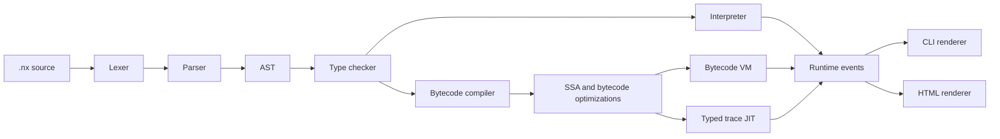

<div align="center">
  

# Naux

  <p><strong>Experimental language runtime, bytecode VM, and compiler optimization workspace.</strong></p>

  <p>
    
    
    
    
    
  </p>
</div>

> [!WARNING]
> **Active Development & Experimental Research Project**
> Naux is personal research software under active development. It may contain bugs, undocumented behaviors, incomplete components, and unsafe optimizer/runtime experiments. It is shared publicly for learning, review, and experimentation, but it is **not recommended for production use** or for systems where failure would matter.

> [!CAUTION]
> **MIT Licensed, No Warranty:** Use, modify, or distribute this project entirely at your own risk. The author provides no support, warranty, safety guarantee, or liability for crashes, data loss, security issues, hardware/software problems, downtime, or any other consequences from using this software.

## Table Of Contents
- [Overview](#overview)
- [Current Capabilities](#current-capabilities)
- [Quick Start](#quick-start)
- [TUI IDE](#tui-ide)
- [Language Example](#language-example)
- [Compiler Pipeline](#compiler-pipeline)
- [CLI Reference](#cli-reference)
- [Development Workflow](#development-workflow)
- [Repository Layout](#repository-layout)
- [Documentation](#documentation)
- [License](#license)

## Overview

Naux is a small language/runtime project built around a complete compiler stack:

- A lexer, parser, type checker, and interpreter used as the semantic reference path.
- A bytecode compiler and VM used as the main executable runtime path.
- SSA, verifier, e-graph, and bytecode materialization work for compiler optimization.
- A typed trace JIT path for selected `x86_64` runtime scenarios.
- Runtime event rendering for CLI and HTML output.
- Algorithm-oriented standard library coverage for list, map, math, graph, and collection workloads.

The project is intentionally compact: frontend, runtime, VM, optimizer, benchmarks, and diagnostics live in the same workspace so behavior can be tested end to end.

## Current Capabilities

| Area | Status | Notes |
| --- | --- | --- |
| Lexer and parser | Active | Parses `.nx` source into the Naux AST. |
| Type checking | Active | Covers core scalar, collection, function, and action paths. |
| Interpreter | Active | Semantic reference path for runtime behavior. |
| Bytecode VM | Active | Main executable backend for `.nx` programs. |
| TUI IDE | Active | Terminal editor/checker/runner for quick demos and local inspection. |
| SSA pipeline | Active | CFG, dominators, phi placement, rename, verifier, and safe cleanup passes. |
| Optimizer materialization | Active | Selected safe bytecode rewrites are materialized back into the executable path. |
| E-graph experiments | Active | Proof-gated arithmetic and bitwise rewrite experiments. |
| Typed trace JIT | Experimental | Targeted `x86_64` path; not a general compatibility guarantee. |
| Perf tooling | Active | Local benchmark commands and perf gate scripts. |

## Quick Start

From the repository root:

```powershell
cargo run -p naux -- run naux-lang/examples/hello.nx
cargo run -p naux -- run naux-lang/examples/graph_bfs.nx
cargo run -p naux -- doctor
```

On Windows, if Cargo selects the MSVC toolchain and fails with `link.exe not found`, either install Visual Studio Build Tools with the C++ workload or use the GNU toolchain:

```powershell
$env:CARGO_TARGET_DIR = 'D:\cargo-target-langnaux'
cargo +stable-x86_64-pc-windows-gnu run -p naux -- run naux-lang/examples/hello.nx
```

## TUI IDE

Open a real `.nx` file in the terminal UI:

```powershell
$env:CARGO_TARGET_DIR = 'D:\cargo-target-langnaux'
cargo +stable-x86_64-pc-windows-gnu run -p naux -- ide naux-lang/examples/hello.nx
```

Inside the IDE:

```text
:show
:check
:run vm
:run interp
:quit
```

For a screenshot-friendly run, open a non-empty file, show the buffer, check it, then run it:

```text
:show
:check
:run vm
```

## Language Example

```text
$n = 10
$i = 0
$sum = 0

~ loop $n
    $sum = $sum + ($i * 3 + 1)
    $sum = $sum - ($i % 7)
    $i = $i + 1
~ end

^ $sum
```

Run it with:

```powershell
cargo run -p naux -- run path\to\program.nx --engine vm
```

## Compiler Pipeline



## CLI Reference

Core commands:

```text
naux run <file.nx> [--engine vm|interp|jit]
naux check <file.nx>
naux fmt <path-or-dir>
naux test
naux doctor [--json --out <file>]
naux ide [file.nx]
```

Developer commands:

```text
naux dev ir <file.nx>
naux dev disasm <file.nx>
naux dev bench <file.nx> --engine vm --iters 100
naux dev benchrt <file.nx> --engine jit --trace-only
naux dev refine <file.nx>
naux dev region <file.nx>
naux dev effects <file.nx>
```

Useful examples:

```powershell
cargo run -p naux -- dev ir naux-lang/examples/bench_sum_dense.nx
cargo run -p naux -- dev disasm naux-lang/examples/bench_sum_dense.nx
cargo run -p naux -- dev bench naux-lang/examples/bench_sum_dense.nx --engine vm --iters 100
```

## Development Workflow

Recommended checks before publishing code changes:

```powershell
cargo fmt --manifest-path naux-lang/Cargo.toml --all -- --check
cargo clippy --manifest-path naux-lang/Cargo.toml --all-targets --all-features -- -D warnings
cargo test -p naux --tests
cargo check --workspace
```

Focused semantic gate:

```powershell
cargo test -p naux --test parity_contract
```

If using the Windows GNU toolchain:

```powershell
$env:CARGO_TARGET_DIR = 'D:\cargo-target-langnaux'
cargo +stable-x86_64-pc-windows-gnu test -p naux --tests
cargo +stable-x86_64-pc-windows-gnu check --workspace
```

## Repository Layout

```text
.
|-- naux-lang/          Main compiler, runtime, VM, CLI, tests, and examples.
|-- tools/perf-gates/   Rust perf-gate utilities.
|-- scripts/            Local CI, perf, and report helpers.
|-- docs/               Public technical documentation.
|-- benchmarks/         Benchmark inputs and generated local reports.
|-- assets/             Project images and public visual assets.
|-- naux-rs/            Legacy compatibility crate, excluded from the workspace.
|-- naux-meta-coq/      Formal-model workspace, kept separate from the active crate.
```

Important source paths:

```text
naux-lang/src/lexer.rs           Tokenization
naux-lang/src/parser/            Parser implementation
naux-lang/src/typecheck.rs       Type checking
naux-lang/src/runtime/           Interpreter/runtime values/events
naux-lang/src/vm/                Bytecode, VM, SSA, e-graph, JIT paths
naux-lang/src/cli/               CLI, TUI IDE, doctor, dev tools
naux-lang/tests/                 Integration and parity tests
naux-lang/examples/              Example .nx programs
```

## Documentation

Start here:

- [docs/README.md](docs/README.md): documentation index.
- [docs/language_spec.md](docs/language_spec.md): current language surface and semantic rules.
- [docs/compiler_pipeline.md](docs/compiler_pipeline.md): frontend, IR, bytecode, VM, and JIT overview.
- [docs/stdlib_algo.md](docs/stdlib_algo.md): algorithm and graph standard library coverage.
- [naux-lang/SPEC.md](naux-lang/SPEC.md): crate-level language notes.
- [USAGE.md](USAGE.md): local build, test, and diagnostics workflow.

## License

Naux is public under the MIT License. It is also marked as experimental
personal research software: use it at your own risk, with no warranty,
support promise, safety guarantee, or liability from the author.

See [LICENSE](LICENSE) for the full notice and license text.
