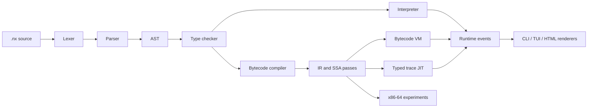

<div align="center">
  

# NAUX

  <p><strong>An experimental programming language, compiler, runtime, and native-code laboratory.</strong></p>

  <p>
    
    
    
    
  </p>

  <p>
    <a href="#build-from-source"><strong>Build from source</strong></a>
    ·
    <a href="tutorial/README.md"><strong>Language tutorial</strong></a>
    ·
    <a href="docs/s1_learn_quick_reference_v0_1.md"><strong>Quick reference</strong></a>
  </p>
</div>

NAUX is a hands-on language implementation covering the path from `.nx`
source code to interpretation, bytecode execution, optimization, and
experimental native execution. The repository includes the compiler/runtime
source, integration tests, examples, developer tools, and a reproducible
cross-language benchmark harness.

> [!WARNING]
> NAUX is active experimental research software. It may contain incomplete
> features, undocumented behavior, and unsafe compiler/runtime experiments.
> Do not use it for production or safety-critical systems.

## Highlights

| Area | Available implementation |
|---|---|
| Language frontend | Span-aware lexer, parser, formatter, diagnostics, and type checking |
| Execution | Reference interpreter and bytecode virtual machine |
| Compiler IR | Stack IR, SSA construction, CFG/dominator analysis, and verification |
| Optimization | Proof-gated rewrites, e-graph experiments, refinement analysis, and specialization infrastructure |
| Native paths | Typed trace JIT plus verifier-gated x86-64 encoding/execution experiments |
| Language systems | Regions, effects, ownership experiments, closures, and collection semantics |
| Developer UX | CLI, project scaffolding, health checks, verification workflow, and terminal IDE |
| Evidence | Integration/parity tests and C/C++/Go/Rust/Zig benchmark baselines |

The table describes code that exists in this repository. It is not a
production-readiness or performance claim.

## Quick start

### Binary release status

NAUX Learn 0.1.4 is available for Linux x86-64 GNU as an **experimental
pre-release**. It supports interactive keyboard input, deterministic redirected
input, and receipt-backed installation and removal:

```bash
curl -fsSL https://github.com/x2t8/Naux/releases/download/v0.1.4-learn/nauxup.sh | sh
```

This unsigned artifact is dynamically linked against the declared GNU/Linux
host boundary. It is not a production, security, sandbox, compatibility, or
native-performance release. Review the script or use the archive and
`SHA256SUMS` and `PROVENANCE.tsv` assets manually if piping a remote bootstrap
is inappropriate for your trust policy.

### Build from source

Requirements:

- a recent stable Rust toolchain;
- Cargo;
- Linux, macOS, or Windows for the portable frontend/VM paths;
- Linux x86-64 for Linux-specific native experiments.

From the repository root:

```bash
cargo run -p naux -- run naux-lang/examples/hello.nx
cargo run -p naux -- run naux-lang/examples/graph_bfs.nx
printf '4 10 -3 5 30\n' | cargo run -p naux -- run naux-lang/examples/learn_sum.nx
cargo run -p naux -- doctor
```

Run the test suite:

```bash
cargo test --workspace
```

On Windows with the GNU Rust toolchain:

```powershell
$env:CARGO_TARGET_DIR = 'D:\cargo-target-langnaux'
cargo +stable-x86_64-pc-windows-gnu run -p naux -- run naux-lang/examples/hello.nx
```

## Language example

```text
$n = 10
$i = 0
$sum = 0

~ loop $n
    $sum = $sum + ($i * 3 + 1)
    $sum = $sum - ($i % 7)
    $i = $i + 1
~ end

^ $sum
```

Run a program with a selected engine:

```bash
cargo run -p naux -- run path/to/program.nx --engine vm
```

The current surface language uses:

- `$name` for variables;
- `~ ... ~ end` for structured blocks;
- `^ expression` for returns;
- `!action` for runtime actions.

See the [language specification](docs/language_spec.md) for the admitted
surface behavior.

## Editor support

The canonical, dependency-free TextMate grammar is published separately at
[`x2t8/naux-grammar`](https://github.com/x2t8/naux-grammar) and mirrored under
`vscode/naux-lang` for compiler-surface drift checks. It defines `.nx`,
`source.naux`, the `naux` language id, and all currently registered public
builtins. The grammar is technically prepared for GitHub Linguist, but NAUX is
not yet a Linguist-recognized language; upstream submission remains gated by
Linguist's independent real-world usage requirement.

## Current execution pipeline



Unsupported optimized/native forms are expected to reject or fall back
according to their declared boundary; silent semantic divergence is treated
as a bug.

## CLI

Common commands:

```text
naux run <file.nx> [--engine vm|interp|jit] [--mode plain|cli|html|json]
naux check <file.nx>
naux fmt <path-or-dir>
naux test
naux verify
naux doctor [--json --out <file>]
naux ide [file.nx]
```

`naux run <file.nx>` uses plain `!say` output by default. A controlling terminal
provides live, prompted keyboard input; redirected stdin remains bounded UTF-8
batch input for judge and script parity through `read_int()`, `read_token()`,
and `read_line()`. See the
[NAUX Learn batch-I/O contract](docs/s1_learn_batch_io.md) for exact EOF,
cursor, size, and fallback semantics. Use `--mode cli` for the ritual event
renderer. Common lexer, parser, type, and runtime failures use the bounded
[NAUX Learn source-diagnostic contract](docs/s1_learn_diagnostics.md) across
normal `run` and `check` paths.

The versioned [NAUX Learn exercise corpus](docs/s1_learn_corpus.md) contains 30
deterministic cases spanning introductory programming, search, sorting, graph,
greedy, and dynamic programming. Its acceptance carrier executes every
solution through the normal `naux run` command.
The [NAUX Learn quick reference v0.1](docs/s1_learn_quick_reference_v0_1.md)
defines the smaller learner-facing compatibility profile and carries executed
VM/interpreter examples. Normal learner execution is fail-closed under the
[bounded execution envelope](docs/s1_learn_execution_envelope.md), whose work
units are source-semantic checkpoints rather than backend instructions.
The [supported-host bundle contract](docs/s1_learn_binary_bundle.md) defines a
sealed Linux x86-64 GNU directory artifact whose prebuilt binary can verify,
install, and run the first learner program without Rust or Cargo. This remains
a dynamically linked, Rust-seeded experimental boundary, not sovereignty or a
production release.

Compiler and runtime inspection:

```text
naux dev ir <file.nx>
naux dev disasm <file.nx>
naux dev bench <file.nx> --engine vm --iters 100
naux dev benchrt <file.nx> --engine jit --iters 100
naux dev refine <file.nx>
naux dev region <file.nx>
naux dev effects <file.nx>
```

Open the terminal IDE:

```bash
cargo run -p naux -- ide naux-lang/examples/hello.nx
```

Inside the IDE:

```text
:show
:check
:run vm
:run interp
:quit
```

## Benchmarks

The benchmark harness compares equivalent workloads across NAUX, C, C++, Go,
Rust, and Zig. Generated binaries, raw samples, and machine-local reports are
excluded from Git.

```bash
CPU_CORE=0 N=100000 REPS=50 ITERS=50 WARMUP_MS=100 \
    ./scripts/bench_cross_language.sh
```

Results are written under `target/perf/`. A local observation is not a public
performance claim unless its environment, checksums, samples, toolchains, and
repository identity satisfy the published benchmark contract.

See [benchmark methodology](docs/benchmarks.md).

## Development

Recommended checks:

```bash
cargo fmt --all -- --check
cargo clippy --workspace --all-targets --all-features -- -D warnings
cargo test --workspace
npm --prefix vscode/naux-lang test
```

Useful focused commands:

```bash
cargo test -p naux vm::ssa -- --nocapture
cargo test -p naux vm::compiler -- --nocapture
cargo run -p naux -- dev ir naux-lang/examples/bench_sum_dense.nx
cargo run -p naux -- dev disasm naux-lang/examples/bench_sum_dense.nx
```

## Repository layout

```text
.
|-- naux-lang/          Compiler, runtime, VM, CLI, tests, and examples
|-- distribution/       Reusable scope-owned packaging inputs
|-- archive/releases/   Withdrawn release notes and acceptance evidence
|-- benchmarks/         Cross-language benchmark sources
|-- scripts/            Benchmark, validation, and reporting tools
|-- tools/perf-gates/   Rust performance-gate utilities
|-- naux-meta-coq/      Separate formal-model workspace
|-- vscode/naux-lang/   Mirror of the canonical MIT-licensed NAUX grammar
|-- docs/               Active public language and benchmark documentation
|-- tutorial/           Current learner-facing guides
|-- assets/             Public project assets
```

Important implementation paths:

```text
naux-lang/src/lexer.rs       Tokenization
naux-lang/src/parser/        Parsing
naux-lang/src/typecheck.rs   Type checking
naux-lang/src/runtime/       Interpreter and runtime values
naux-lang/src/vm/            Bytecode, SSA, optimizer, and JIT
naux-lang/src/core/          Typed semantic and native-code experiments
naux-lang/src/cli/           CLI and developer tools
naux-lang/tests/             Integration and parity evidence
```

## Public documentation

- [NAUX Learn tutorial index](tutorial/README.md)
- [Install on Linux](tutorial/01-install-linux.md)
- [Install on Windows](tutorial/02-install-windows.md)
- [Write the first program](tutorial/03-first-program.md)
- [Practice algorithms](tutorial/04-algorithms.md)
- [Uninstall NAUX Learn](tutorial/05-uninstall.md)
- [Troubleshooting](tutorial/06-troubleshooting.md)
- [Usage and local workflow](USAGE.md)
- [Language behavior](docs/language_spec.md)
- [Memory model](MEMORY_MODEL.md)
- [Backend parity contract](PARITY_CONTRACT.md)
- [Benchmark methodology](docs/benchmarks.md)
- [Performance-claim contract](PERF_CONTRACT.md)
- [Standard algorithm surface](docs/stdlib_algo.md)
- [NAUX Learn exercise corpus](docs/s1_learn_corpus.md)
- [NAUX Learn quick reference v0.1](docs/s1_learn_quick_reference_v0_1.md)
- [NAUX Learn bounded execution envelope](docs/s1_learn_execution_envelope.md)
- [NAUX Learn supported-host bundle](docs/s1_learn_binary_bundle.md)
- [Research Preview trust and provenance](RELEASE_PROVENANCE.md)
- [Security policy](SECURITY.md)
- [Compatibility policy](COMPATIBILITY.md)
- [Support and issue policy](SUPPORT.md)
- [Withdrawn release evidence](archive/README.md)
- [Compiler IR specification](naux-lang/docs/IR_SPEC.md)
- [Canonical NAUX grammar](https://github.com/x2t8/naux-grammar)
- [Monorepo grammar mirror and Linguist candidate](vscode/naux-lang/README.md)

Internal planning and unpublished research strategy are intentionally not part
of the public repository surface.

## License

NAUX is licensed under the MIT License and provided without warranty.
